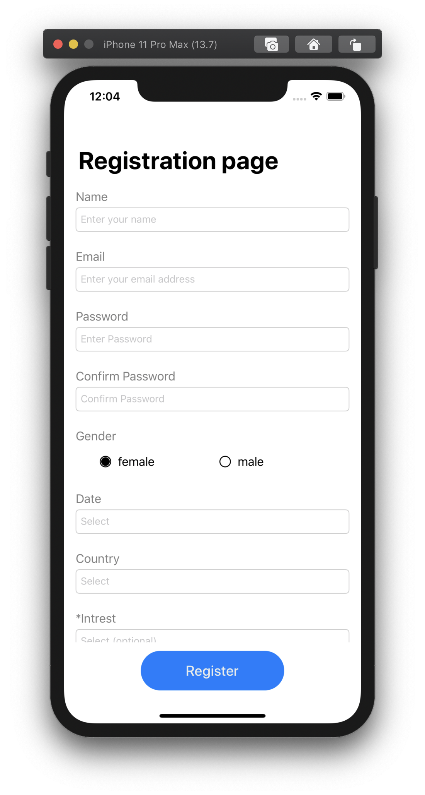
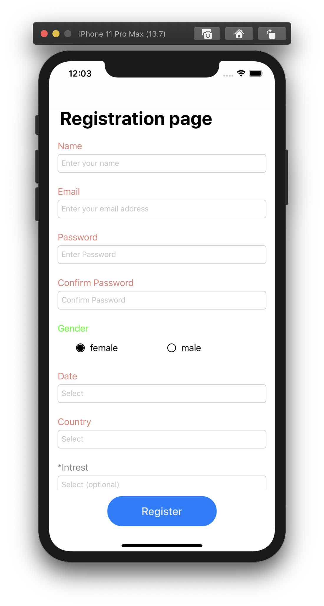
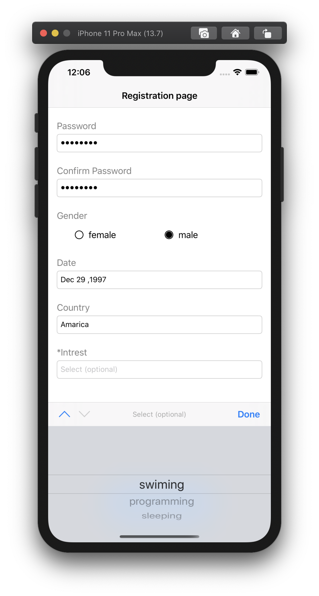
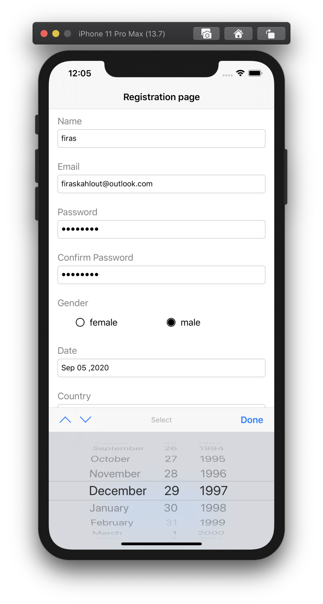
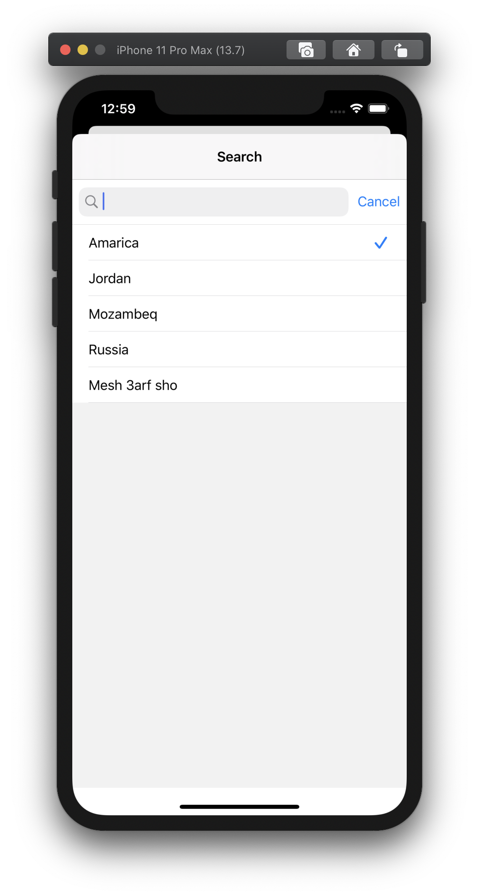

# RegistrationProject

### this project includs:
Reusable & Maintainable Form components,
that you can customize Validation Rules and Input Type for each component

## Screenshots 


### Validation failure  


### Input Types
* Data Picker


* Date Picker


* Table View (List)


### CocoaPods

Dependencies in this project are provided via [CocoaPods](https://cocoapods.org). Please install all dependecies with the following command:

```bash
$ pod install
```

### Dependencies
* [IQKeyboardManagerSwift](https://github.com/hackiftekhar/IQKeyboardManager)
